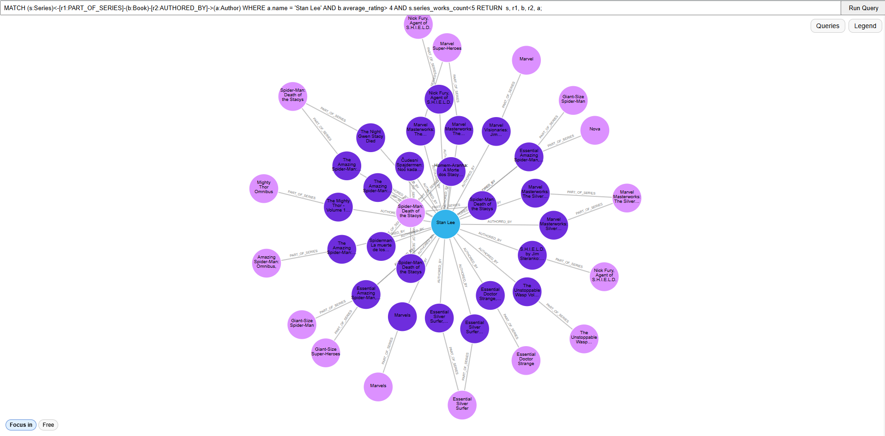
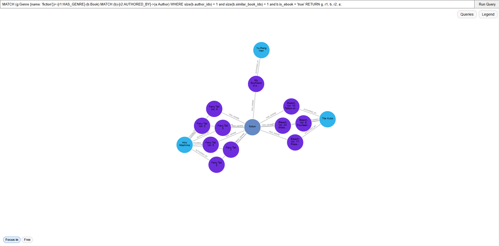
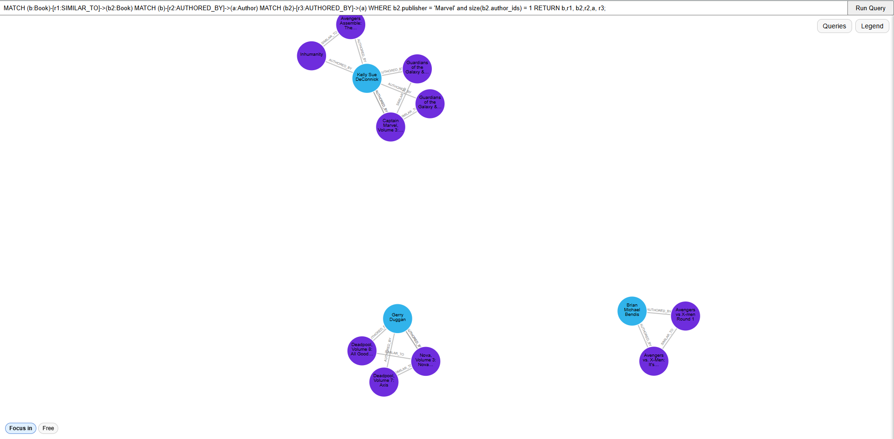
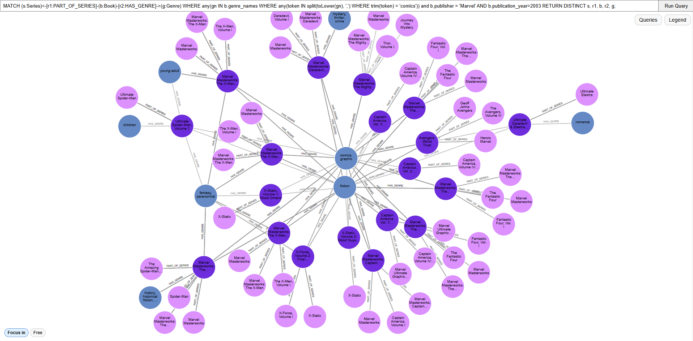
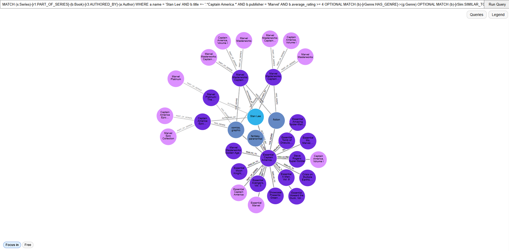

# ✨ Neo4j Project — The Link Lords
### Exploring Goodreads Comics & Graphic Novel Data Using Neo4j

</br>

# 📚 1. Data Choice

For this project, we selected the <a href="https://cseweb.ucsd.edu/~jmcauley/datasets/goodreads.html">**Goodreads Comics & Graphic Novels dataset**</a>, which provides a rich, highly connected structure ideal for graph modeling. The dataset includes relationships between:

- Books  
- Authors  
- Genres  
- Series  
- Users  
- Reviews  

This project models Goodreads Comics & Graphic Novel data as a graph to explore complex relationships between books, users, authors, series, and reviews. A graph database was chosen to reveal hidden patterns in reading behavior, content similarity, and author influence. 

Direct link to download: 
- Genre Subset: <a href="https://mcauleylab.ucsd.edu/public_datasets/gdrive/goodreads/byGenre/goodreads_books_comics_graphic.json.gz">goodreads_books_comics_graphic.json.gz</a>, <a href="https://mcauleylab.ucsd.edu/public_datasets/gdrive/goodreads/byGenre/goodreads_interactions_comics_graphic.json.gz">goodreads_interactions_comics_graphic.json.gz</a>, <a href="https://mcauleylab.ucsd.edu/public_datasets/gdrive/goodreads/byGenre/goodreads_reviews_comics_graphic.json.gz">goodreads_reviews_comics_graphic.json.gz</a>
- Meta-data: <a href="https://mcauleylab.ucsd.edu/public_datasets/gdrive/goodreads/goodreads_book_authors.json.gz">goodreads_book_authors.json.gz</a>, <a href="https://mcauleylab.ucsd.edu/public_datasets/gdrive/goodreads/goodreads_book_works.json.gz">goodreads_book_works.json.gz</a>, <a href="https://mcauleylab.ucsd.edu/public_datasets/gdrive/goodreads/goodreads_book_series.json.gz">goodreads_book_series.json.gz</a>, <a href="https://mcauleylab.ucsd.edu/public_datasets/gdrive/goodreads/goodreads_book_genres_initial.json.gz">goodreads_book_genres_initial.json.gz</a>


We chose this dataset because:

- Comics often have **multiple authors, genres, editions, and user interactions**, making Neo4j the ideal database to represent these relationships.
- It allows us to explore **content similarity**, **cross-series relationships**, and **collaborative author networks**.
- The dataset is large enough to demonstrate Neo4j’s ability to scale and efficiently run multi-hop queries.
- Traditional relational models struggle with these highly interconnected patterns, whereas Neo4j provides expressive and intuitive graph traversal.


<br/>

# 🔧 2. Data Loading Process

The Goodreads Comics dataset was provided as **large JSON files**, which cannot be efficiently imported using Neo4j’s standard `LOAD CSV`. Therefore, **APOC procedures** were enabled in Neo4j Desktop and used for ingestion via `apoc.load.json`.

To ensure scalability and correctness, we followed a **three-phase loading strategy**.


## ⚙️ Loading Strategy

### **Phase 1 — Indexing Before Import**
Before loading any data, **range indexes** were created on all primary identifier fields to support fast `MERGE` operations and prevent duplicate node creation.

Indexed identifiers included:
- `book_id`
- `author_id`
- `work_id`
- `series_id`
- `user_id`
- `review_id`

This step was critical due to the dataset size (over **11 million nodes**) and heavy use of foreign-key-style relationships.

---

### **Phase 2 — Node Creation**
Nodes were loaded **first**, without relationships, for each entity type:

- `Book`
- `Author`
- `Work`
- `Series`
- `Genre`
- `User`
- `Review`
- `Interaction`

During this phase:
- Foreign keys (IDs and ID arrays) were stored as **node properties**
- No relationships were created yet
- All inserts used `MERGE` on indexed identifiers

Batch loading was performed using APOC **transactional batching** to avoid memory overflow.

---

### **Phase 3 — Relationship Creation**
After all nodes were created, relationships were generated in a second pass using `MATCH` on indexed properties.

Relationship types included:
- `AUTHORED_BY`
- `EDITION_OF`
- `PART_OF_SERIES`
- `HAS_GENRE`
- `READ`
- `RATED`
- `WROTE_REVIEW`
- `SIMILAR_TO`

</br>
This three-step approach ensured:
- Correct graph structure
- No dangling relationships
- Stable memory usage
- High performance during large-scale ingestion

---

## 🧩 Data Loading Challenges & Solutions

| Challenge | Solution |
|--------|--------|
| GB-scale JSON files | Used `apoc.load.json` streaming |
| Memory limitations | Batched transactions + staged loading |
| Duplicate node risk | Indexed `MERGE` on unique IDs |
| Nested JSON complexity | Stored foreign keys as properties |
| Performance bottlenecks | Index-first strategy + tuned batch sizes |


<br/>


# 📊 3. Volume

After loading the full dataset, we validated the graph size using the following Cypher queries.

### **Total Nodes**
```cypher
MATCH (x) RETURN count(x) AS NumNodes;
```
|NumNodes|
|--------|
|11,073,685|


### **Total Relationships**
```cypher
MATCH ()-[r]->() RETURN count(r) AS NumRelationships;
```
|NumRelationships|
|----------------|
11,425,981


<br/>


## 🔍 4. Variety — Interesting Queries & Insights

The following queries demonstrate diverse and meaningful graph traversals across authors, books, series, genres, works, and similarity relationships. Each query explores a **different structural aspect** of the dataset rather than minor variations of the same idea.

---

### 🧠 Query 1 — Stan Lee’s Highly Rated Small-Series Books

```cypher
MATCH (s:Series)<-[r1:PART_OF_SERIES]-(b:Book)-[r2:AUTHORED_BY]->(a:Author) 
WHERE a.name = 'Stan Lee' AND b.average_rating> 4 AND s.series_works_count<5 
RETURN  s, r1, b, r2, a;
```

Purpose:  Identifies highly rated books written by Stan Lee that belong to short or limited series.

Insights:

- Highlights author publishing patterns

- Correlates book quality with series size

- Reduces graph noise using semantic filters



---

### 📘 Query 2 — 2018 Publications: Work → Book → Series

```cypher
MATCH  (w:Work)<-[r1:EDITION_OF]-(b:Book)-[r2:PART_OF_SERIES]->(s:Series) 
WHERE b.publication_year = 2018 
RETURN w, r1, b, r2, s;
```

Purpose: Connects 2018 book editions to their canonical works and series.

Insights:

- Shows edition vs. work structure by connecting publication-year-specific books to their canonical Work entities.

- Highlights publishing activity by year and how those releases map into works and series.

- Supports version/edition analysis by exposing how multiple books can relate back to works (useful for studying editions and metadata consolidation).


---

### 📖 Query 3 — Fiction Ebooks with Single Author & Similarity

```cypher
MATCH (g:Genre {name: 'fiction'})<-[r1:HAS_GENRE]-(b:Book) 
MATCH (b)-[r2:AUTHORED_BY]->(a:Author) 
WHERE size(b.author_ids) = 1 AND size(b.similar_book_ids) = 1 AND b.is_ebook = 'true' 
RETURN g, r1, b, r2, a;
```

Purpose: Extracts a clean subset of fiction ebooks with minimal ambiguity.

Insights: 

- Focuses on digital publishing patterns by filtering specifically for ebooks within the fiction genre.

- Supports similarity-link validation by restricting to books with exactly one similarity connection, making it easier to inspect how SIMILAR_TO metadata is assigned.

- Produces highly readable subgraphs and extracts a clean, well-defined subset by enforcing constraints (low ambiguity / low noise).




---

### 🔗 Query 4 — Similar Marvel Books by the Same Author

```cypher
MATCH (b:Book)-[r1:SIMILAR_TO]->(b2:Book) 
MATCH (b)-[r2:AUTHORED_BY]->(a:Author) 
MATCH (b2)-[r3:AUTHORED_BY]->(a) 
WHERE b2.publisher = 'Marvel' AND size(b2.author_ids) = 1 
RETURN b,r1, b2,r2,a, r3;
```

Purpose: Checks whether similar books also share authorship, focusing on Marvel publications.

Insights: 	

- Validates similarity consistency by checking whether “similar” books also share the same author (author-coherence test).

- Extracts Marvel-specific clusters by filtering similar books to publisher = Marvel, revealing similarity neighborhoods tied to one publisher.

- Reduces ambiguity with single-author filtering (size(b2.author_ids)=1), making author matching and interpretation cleaner.
	
- Shows multi-relation structure around similarity by combining SIMILAR_TO with AUTHORED_BY, useful for explaining why two books are connected.

- Produces a manageable subgraph using WHERE constraints instead of truncating with LIMIT, keeping meaningful relationship context intact.



---

### 🕸️ Query 5 — Marvel Comics (2003): Series → Book → Genre

```cypher
MATCH (s:Series)<-[r1:PART_OF_SERIES]-(b:Book)-[r2:HAS_GENRE]->(g:Genre) 
WHERE 
any(
gn IN b.genre_names 
WHERE any(token IN split(toLower(gn), ',') 
WHERE trim(token) = 'comics')
) 
AND b.publisher = 'Marvel' AND b.publication_year=2003 
RETURN DISTINCT s, r1, b, r2, g;
```

Purpose: Analyzes Marvel’s 2003 comic catalog by series and genre.

Insights: 

- Performs robust genre filtering from messy arrays by tokenizing genre_names and matching an exact normalized token ('comics').

- Builds a time- and publisher-specific slice (Marvel + 2003) to analyze a focused publishing window.

- Reveals series composition by genre by mapping which series contain books tagged with comics-related metadata and what Genre nodes they connect to.

-	Reduces duplicate graph clutter with DISTINCT while preserving all meaningful series–book–genre connections.

-	Supports exploratory catalog analysis (publisher + year + genre token) to identify concentrated clusters of series and their genre associations.



---

### 🧩 Query 6 — Author-Centric Franchise Exploration (Stan Lee & Captain America)

```cypher
MATCH (s:Series)-[r1:PART_OF_SERIES]-(b:Book)-[r3:AUTHORED_BY]-(a:Author) 
WHERE a.name = 'Stan Lee' AND b.title =~ '.*Captain America.*' AND b.publisher = 'Marvel' AND b.average_rating >= 4 
OPTIONAL MATCH (b)-[rGenre:HAS_GENRE]->(g:Genre) 
OPTIONAL MATCH (b)-[rSim:SIMILAR_TO]->(bSim:Book) 
RETURN s, r1, b, r3, a, g, rGenre, bSim, rSim;
```

Purpose: Builds a focused subgraph around Stan Lee’s highly rated Captain America books, showing their series membership and enriching results with optional genre and similarity relationships.

Insights: 

- Builds a highly specific author–franchise slice (Stan Lee + Captain America + Marvel) for targeted exploration rather than broad browsing.

- Adds a quality filter (rating ≥ 4) to focus on stronger-received books and reduce noise without using LIMIT.

- Shows how an author’s high-rated franchise titles cluster into series via PART_OF_SERIES, revealing series structure for that subset.

- Enriches interpretation using OPTIONAL MATCH by attaching genres and similarity links without dropping core results when those links are missing.

- Supports recommendation/related-content analysis by exposing SIMILAR_TO neighbors around the filtered books while keeping authorship and series context visible.



</br>

# 🎉 5. Bells & Whistles (Above & Beyond)

We extended the project well beyond the core requirements by improving usability, visual clarity, performance, and analytical depth for our professor's code.


---

### 🧭 Interactive Side Panels (UI Enhancement)

We implemented two collapsible side panels to significantly improve user experience:


- Legend Panel

    - Displays all node types and relationship types

    - Uses color-coded chips for immediate visual understanding

    - Helps users interpret the graph without prior Neo4j knowledge


---

- Queries Panel

    - Contains six predefined analytical queries

    - Each query card includes:

        - A collapsible, editable Cypher textarea

        - A one-click button to load the query into the input box

        - Inline instructions for execution

        - Queries can be modified and re-run without page reload

</br>

These features greatly improve navigation, clarity, and accessibility.


---

### 🎨 Advanced Graph Visualization & Layout Control

This solved major readability issues when visualizing large subgraphs.

</br>

- We enhanced the default D3 visualization to improve readability and control:

    - Fixed-size circular nodes with wrapped text

    - Relationship type labels rendered directly on edges

    - Dynamic label positioning during force simulation

---

- Added two visualization modes:

    - Focus Mode — viewport-constrained layout to prevent nodes from flying off-screen

    

    - Free Mode — full force-directed simulation

    

</br>
A bottom-left toggle allows users to switch modes instantly


---

### 🧠 Analytical Query Design (No-LIMIT Strategy)

- All sample queries were redesigned to:

    - Avoid LIMIT-based truncation

    - Use semantic WHERE filters instead

    - Preserve meaningful graph structure while reducing noise


- The six queries demonstrate:

    - Author-centric exploration

    - Series and franchise structure

    - Genre-based filtering

    - Content similarity validation

    - Multi-hop graph traversal

    - Optional enrichment with genres and similar books

---

## 🌟 What We’re Most Proud Of and Project Standing Out 

The aspect we are most proud of is our ability to **scale a real-world, multi-million–node dataset into a performant, interactive Neo4j application** while maintaining clarity, usability, and analytical depth.

</br>

Specifically, we are proud that our project stands out as:
- We successfully ingested **over 11 million nodes and relationships** using a carefully designed, index-first, batch-based loading pipeline.

- We avoided naive graph exploration by designing **semantically constrained Cypher queries** that preserve meaning without relying on artificial `LIMIT` clauses.

- We transformed raw graph data into an **interactive, user-friendly exploration tool**, making complex graph relationships understandable even to non-expert users.

- We solved real engineering challenges such as **heap out-of-memory errors**, visualization clutter, and large-result traversal instability through thoughtful redesign rather than shortcuts.

This reflects not only correct Neo4j usage, but strong **data engineering and system design decisions**.

</br>

# 🚀 How to Run the Application

✅ Prerequisites

- Node.js (includes npm)

- Neo4j Desktop with APOC enabled


▶️ Steps to Run

```
# Navigate to the project root directory
cd neo4j-project-the-link-lords

# Install dependencies
npm install

# Start the application
node index.js
```

🌐 Open your browser and visit:
```
http://localhost:3000
```

</br>

# 🏁 Final Notes

- This project demonstrates:

    - Large-scale graph ingestion (11M+ nodes & relationships)

    - Efficient Neo4j data modeling and indexing

    - Advanced Cypher query design

    - Interactive UI-driven graph exploration

    - Real-world dataset handling and performance optimization

</br>
By combining data engineering, graph analytics, and visual design, this project goes well beyond basic Neo4j usage and highlights the strengths of graph databases for highly connected data.


